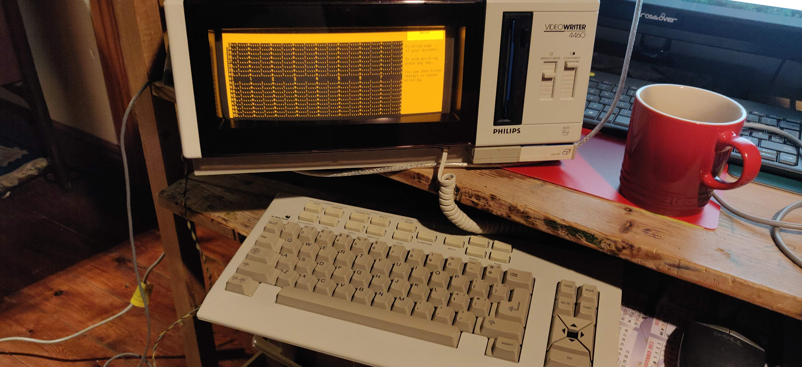
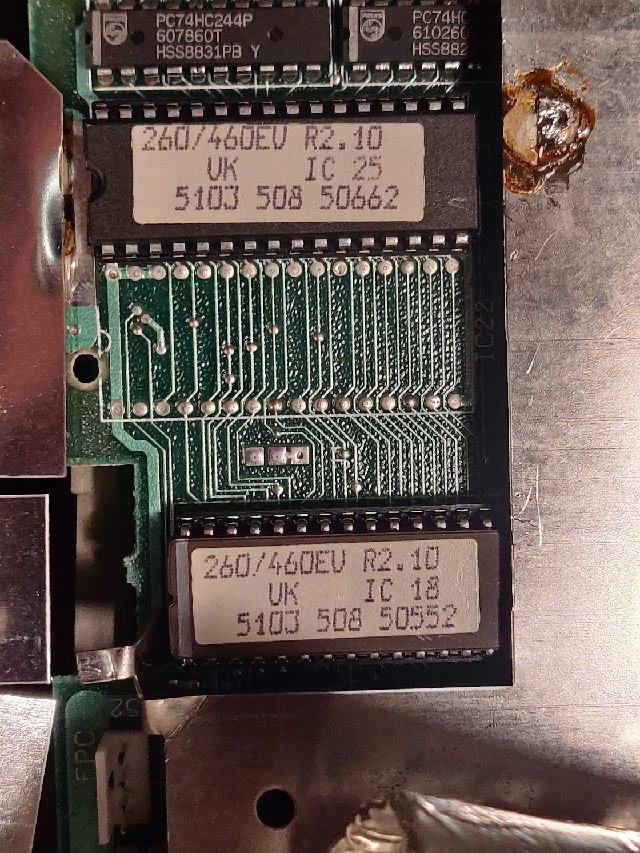
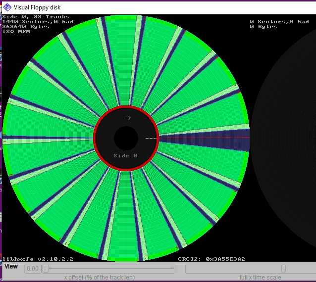


# Video Writer

Collection of information about Philips VideoWriter 4460



[vw 4160 Service manual](docs/vw4160.pdf)

# ROM Dumps

Program rom contents



[32Kb IC18](roms/260-460EV-R2.10-UK-IC-18-5103-508-50552.bin)

[128Kb IC25](roms/260-460EV-R2.10-UK-IC-25-5103-508-50662.bin)


# Disk imaging
Copies of VideoWriter disks have been made with Greaseweazle, the flux transition files are then opened with HxCFloppyEmulator and exported to img files containing raw sector data.



# VWfile
Demonstration program to display files from disk image. Based on VW2MSX.BAS a program by Peter van Overbeek 1992.VW2MSX.BAS a program by Peter van Overbeek 1992

This version uses simulated disk track reading using fseek and fread accesing a disk image file.

Sample session:
              
```
PS C:\GitHub\VideoWriter\src\VWfile> ./VWfile.exe

#1 = Initial
#2 = Another
#3 = Copy of Initial
#4 = Grid page
#5 = Test document
Input file# to read 3
Selected file 'Copy of Initial     '

<<<<<<<< page 1 >>>>>>>>
*       The quick brown fox jumps over the lazy dog.
*       grbuge
*       David
<<<<<<<<  end   >>>>>>>>
```

# MSX2 
VW2MSX was listed using the online simulator WebMSX, google translate was used to better understand its operation.

The original program used a track read function written for the MSX2 in Z80 assembler, this has been recreated into source files in the msx/asm directory. 

# Z80 Disassembler

The Perl tool used to recreate the Z80 assembler listings CPU-Z80 disassembler

```
#!perl

use strict;
use warnings;

use CPU::Z80::Disassembler;
my $dis = CPU::Z80::Disassembler->new;

unlink "hello.ctl";
CPU::Z80::Disassembler->create_control_file("hello.ctl", "hello.bin", 0xC000);

$dis->load_control_file("hello.ctl");
$dis->memory->load_file( "hello.bin", 0xC000);

$dis->code(0xC000, "START");
$dis->labels->add(0xC003, "PRINT");
$dis->labels->add(0xC00D, "DONE");
$dis->analyse;
#$dis->defb(0xC00F, 13, "HELLO");
$dis->defmz(0xC00F, 13, "HELLO");

$dis->write_asm("hello.asm");
```
# Spelling-check dictionary

The addon cartridge 'COMBI PACK 4' 'VW 9104 / 05' contains a rom IC labelled '03771 DICT. UK' I have copied the contents to file, see roms directory.

The rom chip select is connected to the CSRAE on the edge connector.

# Links
https://hblankes.home.xs4all.nl/Museum/txt/videowriter.htm

https://github.com/keirf/Greaseweazle

https://hackaday.io/project/25664-anatomy-of-a-philips-videowriter

https://metacpan.org/source/PSCUST/CPU-Z80-Disassembler-0.07

https://webmsx.org/


